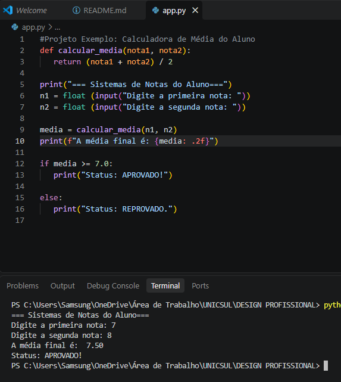

# Exercicio de calculo de media 

O codigo tem como base teorica uma simples entrada de notas do aluno para calculo de média.

## Funções utilizadas

- If
- Else
- Def 

## Tecnologias Utilizadas  

Python 3.13

## Como instalar e executar 

Utilize um software como VS Code baixe o codigo para seu desktop,  e simplismente execute o codigo entrando com 2 valores.  

## Exemplo em execução 

  

## Autor 

**Daimon Isaias, estudante de Ciências da Computação (UNICSUL)**